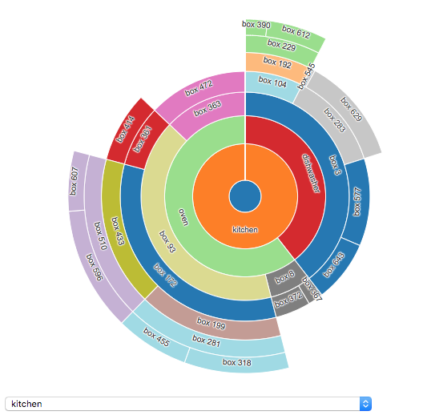
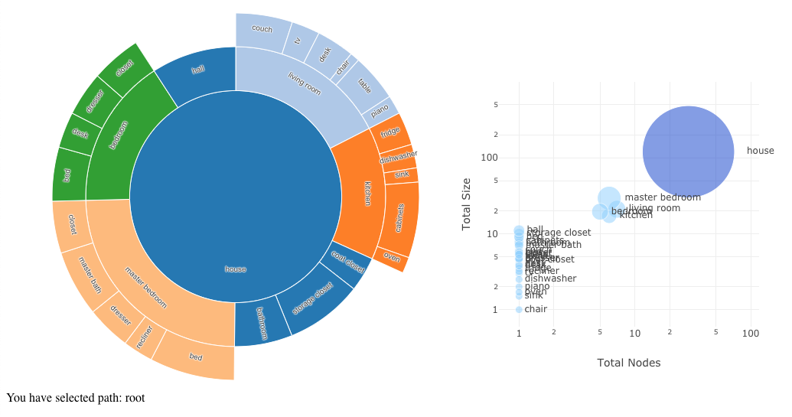

# Dash Sunburst



This repository demonstrates the principles of combining D3 with React, using a Sunburst chart as an example, and was created from the [`dash-component-boilerplate` template](https://github.com/plotly/dash-component-boilerplate). The Demo uses this `Sunburst` component to show the contents of a house, with items being added, removed, and resized over time, and letting you zoom in and out of the rooms and items both from within the component itself and from another control.

To run the demo:
1. Clone this repo
2. Install the dependencies:
```
npm install
```

# Code walkthrough - JavaScript side

Following the structure laid out in the [D3 + React tutorial](https://gist.github.com/alexcjohnson/a4b714eee8afd2123ee00cb5b3278a5f) we make two files: [`d3/sunburst.js`](src/lib/d3/sunburst.js) for the D3 component and [`components/Sunburst.react.js`](src/lib/components/Sunburst.react.js) for its React/Dash wrapper. Following the `dash-component-boilerplate` example, this component is then exported using [`index.js`](src/lib/index.js) which is imported by the main component in [`App.js`](src/demo/App.js).

## Sunburst.react.js

This wrapper simply connects the React component API to the similar structures we create in the D3 component. Excerpting from this file out of order, we see:

```js
Sunburst.propTypes = {
    /**
     * id and setProps are standard for Dash components
     */
    id: PropTypes.string,
    setProps: PropTypes.func,

    /**
     * All the rest are the state of the figure. See the full source for details
     */
    width: PropTypes.number,
    height: PropTypes.number,
    padding: PropTypes.number,
    innerRadius: PropTypes.number,
    transitionDuration: PropTypes.number,
    data: PropTypes.object.isRequired,
    dataVersion: PropTypes.oneOfType([PropTypes.string, PropTypes.number]),
    selectedPath: PropTypes.arrayOf(PropTypes.string)
};
```

In addition to the standard `id` and `setProps` props, we insert all the state needed by the D3 component as props of the React wrapper. This gives us type validation - for the most part anyway; this example doesn't validate the structure of `data`, nor put limits on the numeric fields, but a more production-ready version may want to do this. Note in particular the `dataVersion` prop. We will use this to avoid having to copy - and diff - the entire `data` object, which may be large and tedious. Also `selectedPath`, which is connected to the state of the user interaction with the sunburst, as different parts of the subtree are selected.

```js
render() {
    return <div id={this.props.id} ref={el => {this.el = el}} />;
}
```

In `render` we just create an empty `<div>` and store a reference to it in `this.el`.

```js
componentDidMount() {
    this.sunburst = new SunburstD3(this.el, this.props, figure => {
        const {setProps} = this.props;
        const {selectedPath} = figure;

        if (setProps) { setProps({selectedPath}); }
        else { this.setState({selectedPath}); }
    });
}
```

`componentDidMount` instantiates our D3 component, giving it the element to render into, the props for initial render (it will ignore the Dash-specific ones), and a callback to respond to changes from inside that component. A more complex component might emit a variety of events depending on different user interactions, but in the end all that really matters is the current state of the component, not what specifically changed with this event. Here we know the only thing that changed is `selectedPath` but it would be just as well to call `setProps(figure)` no matter what event was emitted.

```js
componentDidUpdate() {
    this.sunburst.update(this.props);
}
```

Whenever the React component gets new props, it simply forwards them on to the D3 component.

## App.js

We don't need to know anything about the D3 component in order to use the `Sunburst` React component in our app - just what's encapsulated in the `Sunburst` component itself:

```js
constructor() {
    super();
    this.state = {
        transitionDuration: 1000,
        selectedPath: ['living room'],
        dataVersion: 1,
        data: {
            ...
        }
    }
    this.setProps = this.setProps.bind(this);
    this.mutateData = this.mutateData.bind(this);

    this.period = 3;
    this.updateInterval = setInterval(this.mutateData, 1000 * this.period);
}
```

In the `App` constructor we start with a seed state for the `Sunburst` - because this is a simple app where everything is related to that `Sunburst`, its state is stored in the top level of `App.state`, but a more complex app would nest it. We also initialize the interval that will periodically edit the data. We don't need to be concerned with the `mutateData` method, except to know that all it does is call `this.setState({data: updatedData})`

```js
render() {
    const {data, selectedPath} = this.state;
    const selectedPathStr = selectedPath.join(',');
    const paths = getPathStrs(data, '');
    const options = paths.map(path => (
        <option value={path} key={path}>
            {path.split(',').join('->') || 'root'}
        </option>
    ));
    const selectChange = e => {
        this.setState({selectedPath: e.target.value.split(',')})
    };

    return (
        <div>
            <h2>Sunburst Demo</h2>
            <p>Click a node, or select it in the dropdown, to select a subtree.</p>
            <p>Every {this.period} seconds a node will be added, removed, or resized</p>
            <Sunburst
                setProps={this.setProps}
                {...this.state}
            />
            <select value={selectedPathStr} onChange={selectChange}>
                {options}
            </select>
        </div>
    )
}
```

`App` renders some introductory notes, our `Sunburst` component, and a dropdown menu that pulls the complete list of paths out of the same state that's used by the `Sunburst`. You'll notice that whether we select an item by clicking on it directly or via this dropdown, both the dropdown and the `Sunburst` update.

## sunburst.js

Finally, here's the D3 code, all contained in a class we export as `SunburstD3`.

```js
constructor(el, figure, onChange) {
    const self = this;
    self.update = self.update.bind(self);

    self.svg = d3.select(el).append('svg');
    self.pathGroup = self.svg.append('g');
    self.textGroup = self.svg.append('g')
        .style('pointer-events', 'none');

    self.angularScale = d3.scale.linear().range([0, Tau]);
    self.radialScale = d3.scale.sqrt();
    self.colorScale = d3.scale.category20();
    self.partition = d3.layout.partition()
        .value(d => d.size)
        .sort((a, b) => a.i - b.i);

    self.arc = d3.svg.arc()
        .startAngle(d => constrain(self.angularScale(d.x), 0, Tau))
        .endAngle(d => constrain(self.angularScale(d.x + d.dx), 0, Tau))
        .innerRadius(d => Math.max(0, self.radialScale(d.y)))
        .outerRadius(d => Math.max(0, self.radialScale(d.y + d.dy)));

    self.figure = {};

    self.onChange = onChange;

    self.initialized = false;

    self.update(figure);
}
```

Our constructor does 3 things:
1. Creates the container elements that we'll need no matter what specific diagram we render inside: `self.svg` is the `<svg>` element, `self.pathGroup` will contain the sunburst arcs, and `self.textGroup` will hold text, added as a separate group so the text will always be in front of the arcs.
2. Pre-calculates d3 helpers that won't change later (`self.angularScale` through `self.arc`)
3. Sends the initial figure to `self.update`.

`self.update` is the meat, so we'll tackle it in pieces:

### Figure setup
```js
const oldFigure = self.figure;

// fill defaults in the new figure
const width = figure.width || dflts.width;
const height = figure.height || dflts.height;
const padding = figure.padding || dflts.padding;
const innerRadius = figure.innerRadius || dflts.innerRadius;
const transitionDuration = figure.transitionDuration || dflts.transitionDuration;
const {data, dataVersion} = figure;
const selectedPath = figure.selectedPath || [];

const newFigure = self.figure = {
    width, height, padding, innerRadius, transitionDuration,
    data, dataVersion, selectedPath
};
```

Here we stash the previous figure as `oldFigure` and create a new one, inserting default values where values were not provided.

Next comes functions containing our standard D3 code (which was inspired by https://bl.ocks.org/mbostock/4348373 but has been heavily modified, as you can see. Notice that I'm using D3V3 here so some things will change if you're using V4 or V5), but we've broken up the activity by purpose, `transitionToNode`, `updatePaths`, and `setSize`. We'll use these depending on the observed changes. The only items I want to call out within this block are
1. `transitionToNode` is used as the `click` callback for our arcs.
2. At the end of `transitionToNode` is the block:
```js
if(self.onChange) {
    self.figure.selectedPath = getPath(node);
    self.onChange(self.figure);
}
```
So when this is called on a click, it updates the `figure` and we pass it back up the React chain of command. But it's also called during drawing, in which case the figure we pass back up will be the same one we just received. Which makes the next section extremely important...

### Diffing
```js
const change = diff(oldFigure, newFigure);
if(!change) { return; }

const sizeChange = change.width || change.height || change.padding;
const dataChange = change.data;
```

We compare the old and new figures to determine what changed. Here we're concerned with three things:
1) Are there any changes at all? If not, we can bail out now, without running any DOM manipulations. This will happen regularly due to `transitionToNode` as described above.
2) Did the size of the figure change? If so there are more extensive things we need to do, that will require updating the size and position of all our paths and text elements.
3) Did the data change? Inside `diff` we look for `dataVersion`, and if we find it we skip comparing `data` itself between the old and new figures, instead reporting changes in `dataVersion` as `change.data`.

There can be other changes that lead to a truthy `change` without setting either `sizeChange` or `dataChange` - here that would be `innerRadius` and `selectedPath`, but in general if we added styling properties (colors, line widths, font sizes...) they would fall into this category. Those can follow the minimal update pathway below.

### Drawing
```js
if(sizeChange) { setSize(); }

let paths = self.pathGroup.selectAll('path');
let texts = self.textGroup.selectAll('text');

if(dataChange) {
    // clone data before partitioning, since this mutates the data
    self.nodes = self.partition.nodes(addIndices(JSON.parse(JSON.stringify(data))));
    paths = paths.data(self.nodes, getPathStr);
    texts = texts.data(self.nodes, getPathStr);

    // exit paths at the beginning of the transition
    // enters will happen at the end
    paths.exit().remove();
    texts.exit().remove();
}

const selectedNode = getNode(self.nodes[0], selectedPath);

if(self.initialized) {
    transitionToNode(selectedNode)
        .each('end', () => updatePaths(paths, texts, dataChange));
}
else {
    // first draw has no animation, and initializes the scales
    self.angularScale.domain(selectedX(selectedNode));
    self.radialScale.domain(selectedY(selectedNode))
    self.radialScale.range(selectedRadius(selectedNode));

    updatePaths(paths, texts, dataChange);

    self.initialized = true;
}
```

If the size and data did not change, all we do is select the paths and texts, find the selected node, transition to it, and, upon finishing that transition, update the paths - and `updatePaths` knows about `dataChange` so it can skip the `enter()` steps.

Now lets open the JavaScript demo environment:
```
npm run start
```

Lo and behold, we have a zoomable sunburst chart, connected to changing data and sibling UI controls, drawn with D3 and React :tada: There are of course bits of polish to be added if this component were to be used in production - shrinking or removing text that's too big for its arc, and creating style props, for example, and nicer tooltips than the built-in `<title>` elements. But the principles are the same.

# Code Walkthrough - Python side

`dash-component-boilerplate` makes it super easy to connect the React component we just made to Python. As in its [README](https://github.com/plotly/dash-component-boilerplate), run:
```
npm run build:js-dev
npm run build:py
```
(At the time of writing this a webpack bug meant we first needed to bump versions of `webpack` and `webpack-cli`, see [this issue](https://github.com/plotly/dash-component-boilerplate/issues/12)) For these build steps to run without warnings, the `lib/components` directory should contain *only* React components, which is why we moved the D3 code into its own directory, `lib/d3`. Now we can use the component in our Dash app [`usage.py`](usage.py):
```py
from dash_sunburst import Sunburst
```

We'll make a simple app using this component: Feeding some static data to the component, we'll display the selected path elsewhere, and create a plotly.js graph that calculates some statistics based on the displayed data and selected path. First the static data and the app layout:

```py
sunburst_data = { ... }

app.layout = html.Div([
    html.Div(
        [Sunburst(id='sun', data=sunburst_data)],
        style={'width': '49%', 'display': 'inline-block', 'float': 'left'}),
    dcc.Graph(
        id='graph',
        style={'width': '49%', 'display': 'inline-block', 'float': 'left'}),
    html.Div(id='output', style={'clear': 'both'})
])
```
Our `Sunburst` component doesn't support `style`, so we wrap it in an `html.Div`. The `Graph` and `Div#output` are initially blank, but our callbacks will fill them in on load. The content of these callbacks is straightforward Python - check out `usage.py` for the complete code - the key is simply to identify the dependencies of each one using the `@app.callback` decorator:
```py
@app.callback(Output('output', 'children'), [Input('sun', 'selectedPath')])
def display_selected(selected_path):
    # format the selected path for display as text
    ...

@app.callback(Output('graph', 'figure'), [Input('sun', 'data'), Input('sun', 'selectedPath')])
def display_graph(data, selected_path):
    # crawl the sunburst data, along with its selected path,
    # to create the related plotly.js graph
    ...
```

And that's it! `python usage.py` gives us our D3 sunburst diagram, connected through Dash to whatever else we choose.



# More Resources
- Learn more about Dash: https://dash.plot.ly
- View the original component boilerplate: https://github.com/plotly/dash-component-boilerplate
